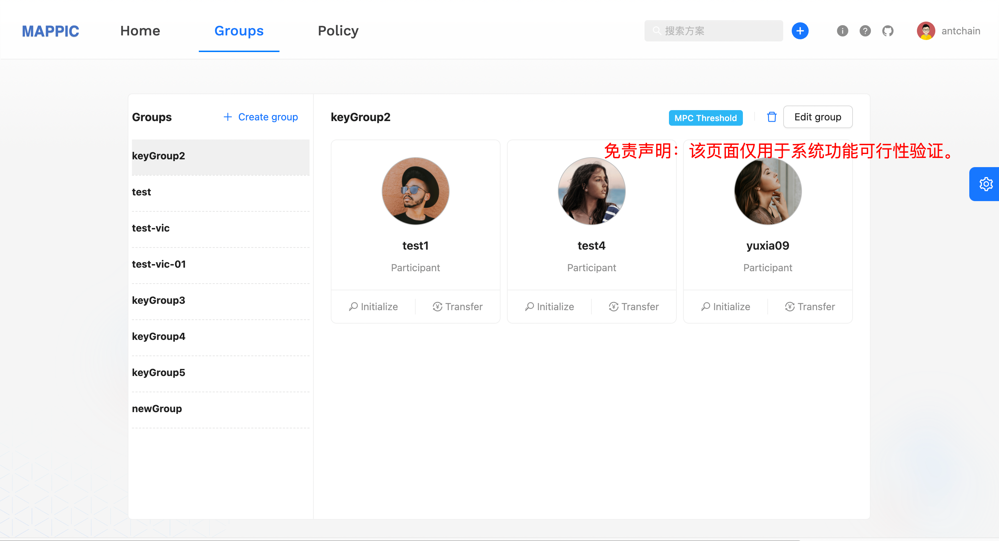
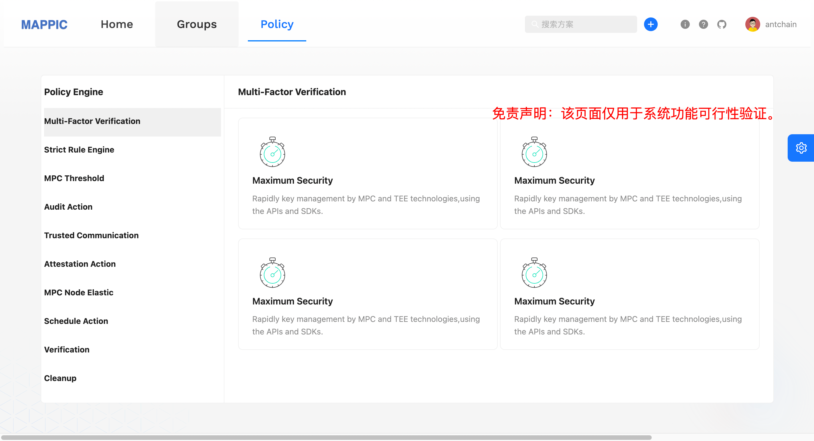
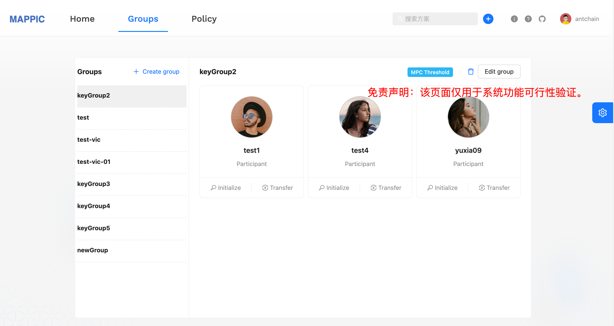
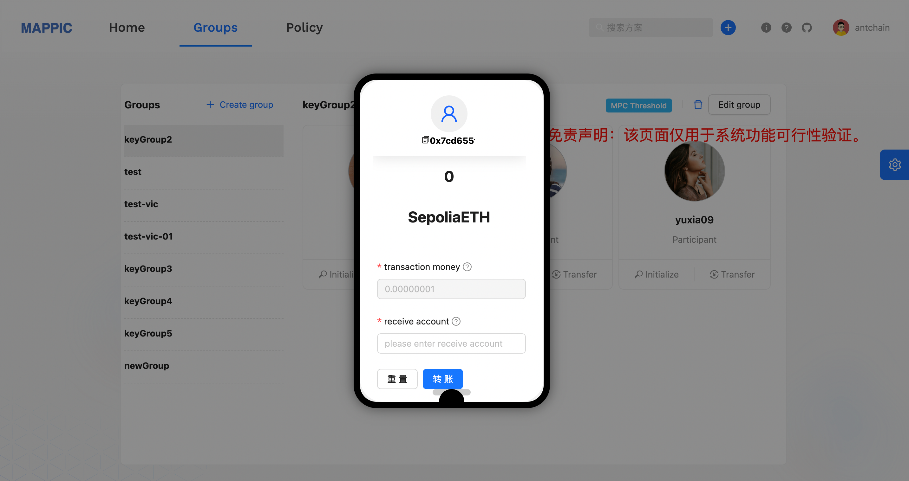

# 部署分布式密钥管理服务

## 概述
蚂蚁链分布式密钥管理服务是蚂蚁链自研MPC密管算法并融合TEE集群化的去中心化密管系统方案，提供安全、高效、易用的分布式密管特性，满足密钥全链路密态分片计算、托管和用户可自定义的安全策略引擎，您无需自行购置云主机，即可在计算巢上快速部署并低代码体验MPC-TEE分布式密管服务，也可接入标准的分布式密管SaaS服务。

基础能力包括:

- 基于MPC-TEE模式实现密钥全流程私钥不可见的密钥生成、密钥导入、密钥恢复、分布式签名等特性.	
- MPC密钥分片融合TEE实现全流程计算、托管、密管，基于安全策略引擎可配置、可定义密管策略配置.	
- MPC N/M分片多门限管理及分片Group备份部署策略，提供3/2、7/5、9/5等主流门限方案	
- 云上标品化部署，提供SDK/RESTful等多种客户端接入模式，分片阿里云多Region跨域部署、跨域托管.	
- 2/2门限配置为例，2台TEE ecs.g7t.xlarge实例提供3000以上key的托管和并行签名计算，满足更低成本.	
- 提供云上SaaS和客户私域部署，计算巢标品分钟级服务部署和快速接入，业务只需关注服务本身.

目前分布式密钥管理服务提供免费试用版本，欢迎大家申请试用，有任何问题欢迎进群交流。
## 实例规格
**ACK集群**

规格：

- 4C、16G内存每台
- EPC：16G，明文：16G
- 2台ecs
- 操作系统 Alibaba Cloud Linux 2.1903 LTS 64位 (Hunting Beagle)
- 实例规格 [ecs.g7t.xlarge](https://www.alibabacloud.com/help/doc-detail/25378.htm#r7t)

更多商业化规格配置参考欢迎进钉钉群（69285014993）咨询！！！

**mysql**

| 版本 | 存储容量 | cpu规格 | 最大连接数 | 时区  |
| --- | ------- | ------- | -------- |-----|
| 8.0 | 100g | 1c 2g | 2000 | 0   |

## 部署流程
### 0.准备工作

在申请试用之前，您需要准备一个阿里云账号，对ECS、VPC、ROS、ACK、RDS等资源进行访问和创建操作。

- 若您使用主账号，可以直接创建服务实例
- 若您使用RAM用户创建服务实例，且是第一次使用阿里云计算巢，需要在创建服务实例前，对使用的RAM用户的账号添加相应资源的权限。

### 1.部署入口
&nbsp;&nbsp;您可以再阿里云的计算巢中通过 **分布式密钥管理** 关键字进行搜索，也可以单击下述链接快速体验

&nbsp;&nbsp;单击[部署链接](https://computenest.console.aliyun.com/service/instance/create/cn-hangzhou?spm=5176.24779694.0.0.59b94d22FDjnMU&type=user&ServiceName=%E5%88%86%E5%B8%83%E5%BC%8F%E5%AF%86%E9%92%A5%E7%AE%A1%E7%90%86%E6%9C%8D%E5%8A%A1&isTrial=true)

### 2.申请试用
在使用之前，请按照提示信息完成申请，在审核通过之后就可以创建服务

### 3.创建服务
- 进入开通配置界面按照我们推荐的[机器规格] 依次填写完服务实例名称，选择地域，付费类型，数据库的账号密码，集群的配置以及网络的配置并点击**确认订单**


- 确认订单页会显示缺少的权限、基础配置和账单，建议申请完缺失的权限后再点击立即创建则进入创建环节


- 点击查看已创建的实例


## 管理资源

- 点击服务实例，进入后可以看到服务详情，等待创建完成，整个流程约20分钟


- 点击查看资源mysql和ecs等实例，并进行维护


## 快速体验
###确认服务部署结果

进入计算巢服务后，选择【我的服务】-> 【服务实例】查看所有目前保有的实例


###查看对外服务ip
单击服务实例名称或ID，进入服务实服务实例详情页，查看访问IP地址。（后续接口请求中存在的${对外服务ip}，均替换为该IP）


###接口介绍

**创建节点**

```java
curl --location --request POST '对外服务ip:8889/api/mappic/pod/createPod' \
--header 'Content-Type: application/json' \
--data '{
        "nodeTag": "mappic234"
        }'
        
// 返回结果
{
    "errorCode": "200",
    "errorMessage": "success",
    "data": "mappic234",
    "success": true
}
```

**生成密钥**

```java
curl --location --request POST '对外服务ip:8889/api/mappic/dkms/key/gen' \
--header 'Content-Type: application/json' \
--data '{
        "keyParams": {
            "type": "ECDSA_K1",
            "length": 512
        },
        "serviceParticipants": [
            "创建节点时的tag",
            "创建节点时的tag"
        ],
        "threshold": 2,
        "totalShares": 2
}'

// 返回结果
{
    "errorCode": "200",
    "errorMessage": "success",
    "data": {
        "keyId": "9390321f-0d4d-4f3f-904b-6cb37accb3e6"
    },
    "success": true
}
```

**导入密钥**

```java
curl --location --request POST '对外服务ip:8889/api/mappic/dkms/key/import' \
--header 'Content-Type: application/json' \
--data '{
        "privateKey": "pem格式的私钥",
        "password":"生成私钥时的密码",
        "keyParams": {
            "type": "ECDSA_K1",
            "length": 512
        },
        "serviceParticipants": [
            "创建节点时的tag",
            "创建节点时的tag"
        ],
        "threshold": 2,
        "totalShares": 2
}'

// 返回结果
{
    "errorCode": "200",
    "errorMessage": "success",
    "data": {
        "instanceId":"xxxxxx"
    },
    "success": true
}
```

**查看密钥状态**

```java
curl --location --request GET 'http://对外服务ip:8889/api/mappic/dkms/key/get?keyId=${keyId}'

// 返回结果
{
    "errorCode": "200",
    "errorMessage": "success",
    "data": {
        "status": "FINISHED",
        "publicKey": "pem格式的公钥",
        "errorMessage": null
    },
    "success": true
}
```
**生成签名**

```java
curl --location --request POST 'http://对外服务ip:8889/api/mappic/dkms/sign/req' \
--header 'Content-Type: application/json' \
--data '{
        "digestHex": "xxxxxxxxxxxxxx",
        "keyId": "密钥生成的keyId"
}'

// 返回结果
{
    "errorCode": "200",
    "errorMessage": "success",
    "data": {
        "instanceId": "b341fec1-3ec1-4fb0-9f11-5226091f0f4a"
    },
    "success": true
}
```
**查看签名**

```java
curl --location --request GET 'http://对外服务ip:8889/api/mappic/dkms/sign/get?instanceId=${instanceId}'

// 返回结果
{
    "errorCode": "200",
    "errorMessage": "success",
    "data": {
        "sign": "xxxxxxxx",
        "status": "FINISHED",
        "errorMessage": null
    },
    "success": true
}
```


### 网页体验(仅用于体验非商业化版本)
**门户网页**


**登录页面**


**管理主页**



**策略管理**



**群组管理**



**以太坊交易demo**




#### 更多服务体验链接
  进群联系管理员 **@霖珂**
# 联系我们
- **联系邮箱**：antchainmappic@service.alipay.com

- **快速问题排查**：可通过技术交流群和我们进行联系，详见下面二维码：

**分布式密钥管理钉钉交流群**：


**分布式密钥管理微信交流群**：


